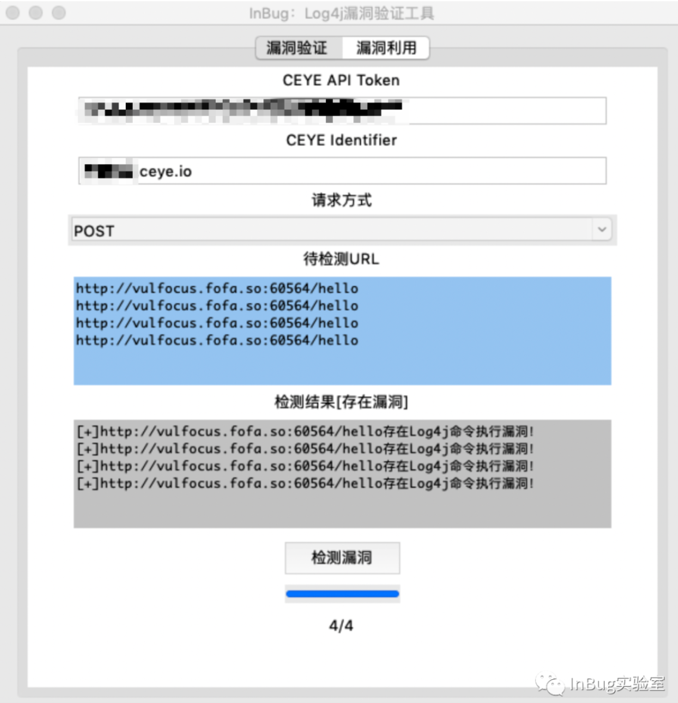
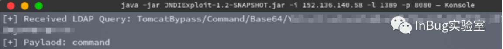
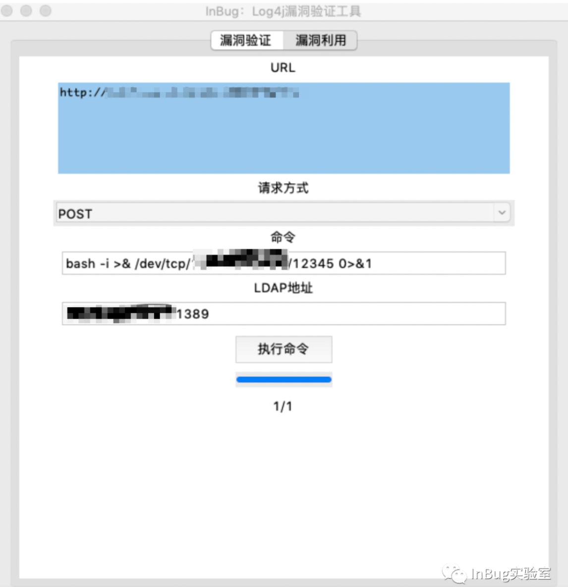
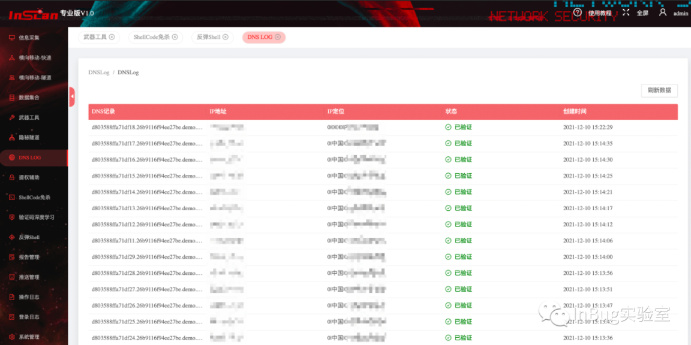
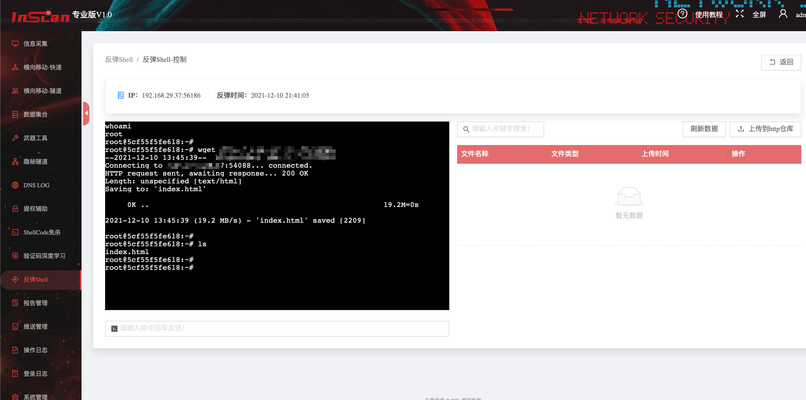

# Log4j 远程代码执行漏洞多线程批量检测利用工具
Log4j 远程代码执行漏洞多线程漏洞批量检测与利用工具

## 简介
本工具只可用于安全测试，勿用于非法用途！
### 工具定位
Log4j 远程代码执行漏洞多线程漏洞批量检测与利用工具

### 工具截图

工具包含漏洞验证功能与漏洞利用功能，在利用漏洞时候需要在公网IP上部署一个JNDI恶意服务(https://github.com/feihong-cs/JNDIExploit)，参数如下图，填入LDAP地址框，然后再使用公网IP监听端口来反弹shell。

当然inscan专业版集成了dnslog与自动化反弹shell功能，可全自动检测和利用 Log4j2远程代码执行漏洞

### 提交反馈
如有好的建议，以及发现BUG。    
GitHub issue: https://github.com/inbug-team/Log4j_RCE_Tool/issues

**官网(生成扫描器)：**
https://www.inbug.org

同时也可通过公众号联系：

